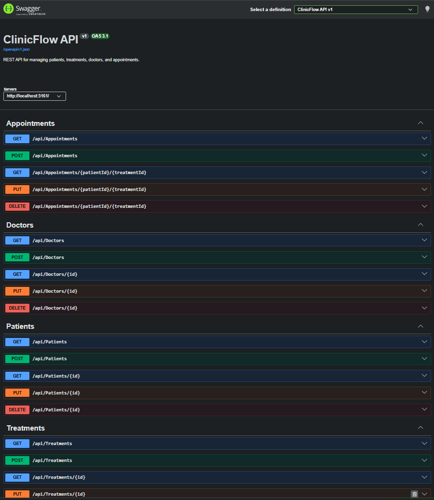
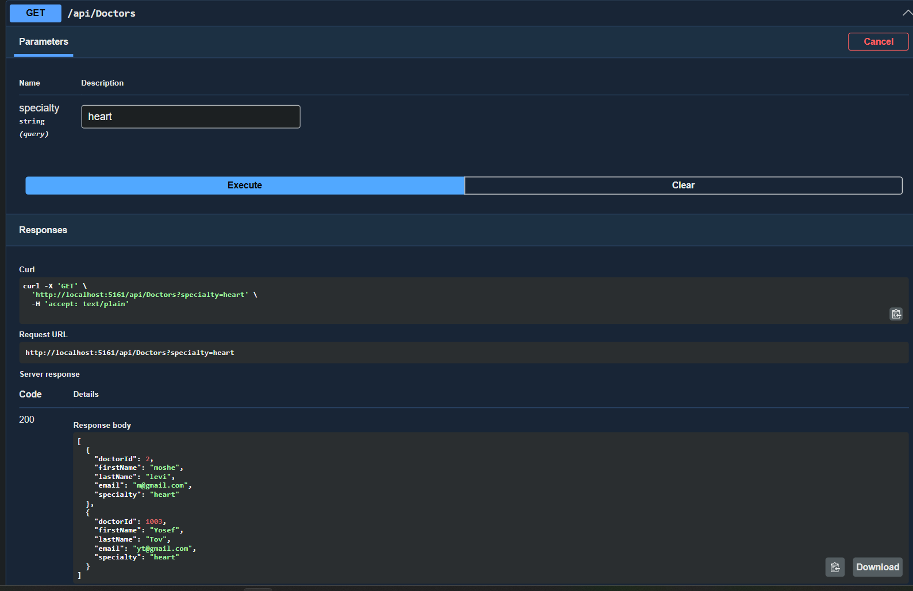
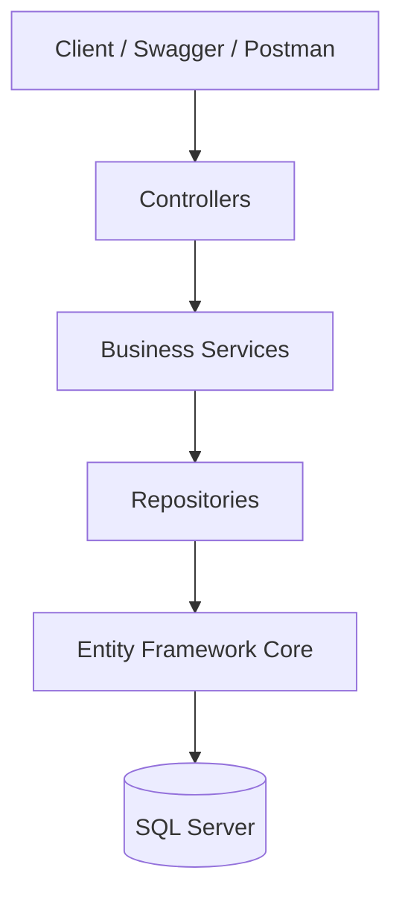
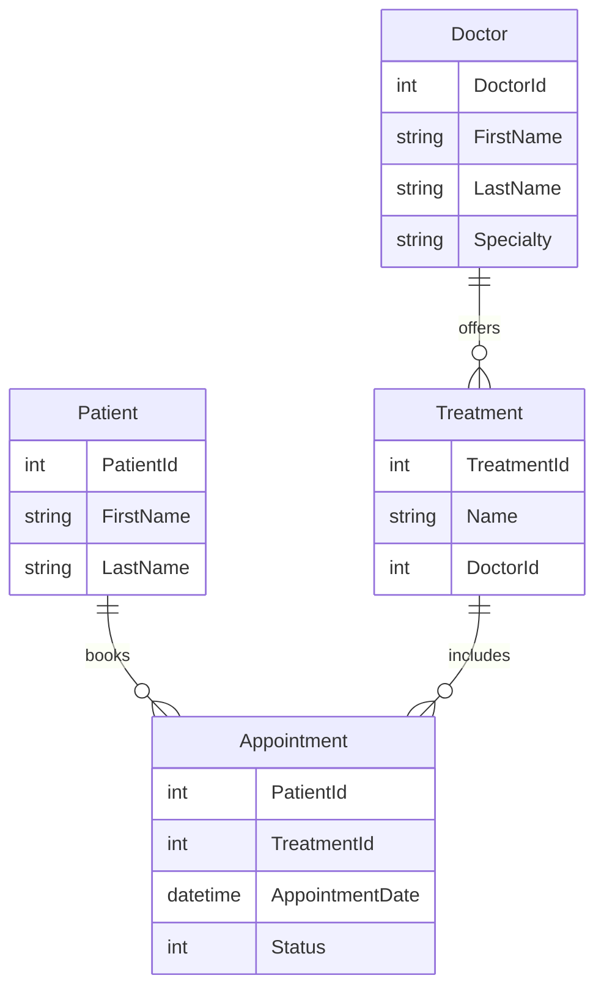

# 🏥 ClinicFlow

> A backend REST API for clinic management built with ASP.NET Core Web API, Entity Framework Core, and SQL Server using a clean layered architecture.

## Overview

ClinicFlow is a backend REST API designed for managing clinics, doctors, patients, treatments, and appointments.

The project demonstrates modern backend development practices including layered architecture, repository pattern, dependency injection, DTO mapping, asynchronous programming, and RESTful API design.

The API is fully documented using Swagger and follows clean separation of concerns, making it scalable, maintainable, and easy to extend.

---

### Swagger Overview



### Example Request

**GET /api/doctors**



## Key Features

- RESTful API
- Layered (N-Tier) Architecture
- CRUD operations
- Entity Framework Core
- SQL Server
- Repository Pattern
- Dependency Injection
- AutoMapper
- DTO-based communication
- Global Exception Handling Middleware
- Swagger / OpenAPI
- Async/Await throughout the data layer

---

## Architecture



The solution follows a layered architecture:

- **Presentation Layer** – Controllers, Middleware
- **Business Layer** – Services, DTOs, AutoMapper
- **Data Layer** – Repositories, EF Core, SQL Server

Each layer has a single responsibility and communicates only with adjacent layers.

---

## Project Structure

```text
ClinicFlow
│
├── ClinicFlow.API
│   ├── Controllers
│   ├── Middleware
│   └── Program.cs
│
├── ClinicFlow.BusinessLogic
│   ├── Services
│   ├── DTOs
│   └── Mapping
│
├── ClinicFlow.DataAccess
│   ├── Entities
│   ├── Repositories
│   └── DbContext
│
└── DB
```

---

## Technologies

| Category | Technologies |
|----------|--------------|
| Language | C# |
| Framework | ASP.NET Core Web API |
| ORM | Entity Framework Core |
| Database | SQL Server LocalDB |
| Architecture | Layered Architecture |
| Design Patterns | Repository Pattern, Dependency Injection |
| Mapping | AutoMapper |
| Documentation | Swagger / OpenAPI |

---

## Database Model



---

## API Endpoints

| Resource | Operations |
|----------|------------|
| Doctors | GET • POST • PUT • DELETE |
| Patients | GET • POST • PUT • DELETE |
| Treatments | GET • POST • PUT • DELETE |
| Appointments | GET • POST • PUT • DELETE |

Swagger provides complete request and response schemas for every endpoint.

---

## Getting Started

Clone the repository:

```bash
git clone https://github.com/af-programmer/ClinicFlow.git
```

Restore packages:

```bash
dotnet restore
```

Apply migrations:

```bash
dotnet ef database update --project ClinicFlow.DataAccess --startup-project ClinicFlow.API
```

Run the application:

```bash
dotnet run --project ClinicFlow.API
```

Open:

```
http://localhost:5161/swagger
```

---

## Future Improvements

- JWT Authentication
- Role-Based Authorization
- Docker Support
- Unit Testing
- Integration Testing
- CI/CD Pipeline
- Logging with Serilog

---

## Author

**Ahuva Fogel**

Software Developer focused on backend systems, full-stack applications, database-driven software, and AI-powered solutions.

GitHub:
https://github.com/af-programmer
